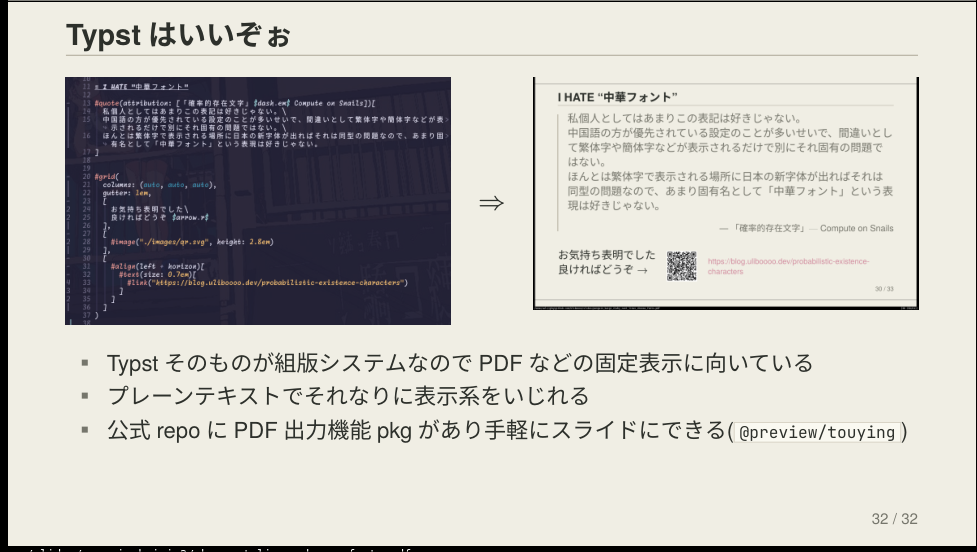

# quire

An uncoated-paper theme for [Touying](https://touying-typ.github.io/) ([Typst](https://typst.app/) slides). A *quire* is a small gathering of paper sheets — and that is how this theme treats a deck: opaque paper, a few matte inks, and thin printed rules — no glow, no blur, no shadows, no rounded corners.

The look follows the "Uncoated Paper" design manual in [`PaperDesign.md`](PaperDesign.md): hierarchy comes from whitespace and hairlines instead of fills and shadows, active/focus states use a soft rose, and the warning color appears only when something is actually wrong.

[日本語は下にあります。](#quire-日本語)



[Oother examples](https://github.com/Uliboooo/quire_typst_theme/blob/main/Examples/)

## Requirements

- Typst with the `touying` package, version `0.7.4`
- Fonts (replaceable via theme options): TeX Gyre Heros, Harano Aji Gothic, JetBrainsMono NF

## Usage

Put `quire-theme.typ` and `quire-code.tmTheme` next to your slides, then:

```typst
#import "@preview/touying:0.7.4": *
#import "quire-theme.typ": *

#show: quire-theme.with(
  aspect-ratio: "16-9",
  config-info(
    title: [Talk title],
    subtitle: [Subtitle],
    author: [Your Name],
    date: datetime.today(),
  ),
)

#title-slide()

= First section          // becomes a section divider + slide header
Body text.

== A subheading          // stays on the same slide (no page break)
More body text.
```

Only `=` starts a new slide (with a section divider in between); `==` renders as a bold in-slide subheading. The first `=` heading is treated as a cover page — pass `cover-first-slide: false` to disable that.

## Slides

| Function | Purpose |
| :--- | :--- |
| `title-slide()` | Title page from `config-info` |
| `slide[...]` | Normal slide: heading in the header, a single 1pt rule below it |
| `section-slide[...]` | Section divider (inserted automatically before each `=`) |
| `focus-slide[...]` | One-point slide on a rose-wash background (instead of a black one) |
| `outline-slide()` | Table of contents; hierarchy shown by ink vs. muted ink, not indentation fills |
| `bare-slide[...]` | Just the paper, no header/footer |

## Helpers

| Function | Purpose |
| :--- | :--- |
| `accent[...]` | Rose bold — the "active / selected" emphasis |
| `warn[...]` | Warning color, only for real warnings |
| `muted[...]` | Secondary, de-emphasized text |
| `glyph[...]` | Wraps a character or word in 「」 corner brackets |
| `card(title: ..., accent: ...)[...]` | Opaque card with a thin border; `accent: true` adds a rose left rule |
| `statement[...]` | A centered, underlined declarative sentence — stronger than a quote |
| `hrule()` | Thin horizontal separator |

## Palette

| Role | Color | Use |
| :--- | :--- | :--- |
| `paper` | `#f1eee5` | Slide background |
| `paper-light` | `#fbf9f2` | Cards, code blocks, table headers |
| `ink` | `#2d302b` | Main text |
| `ink-muted` | `#77766d` | Secondary text |
| `rule` | `#b7b0a2` | Main borders |
| `rule-soft` | `#d0c9bb` | Soft separators |
| `rose` | `#d38ca0` | Active / focus / emphasis |
| `rose-wash` | `#ead2d9` | Soft selected background |
| `warning` | `#a84435` | Critical / urgent only |

No alpha colors anywhere; every surface is opaque.

## Theme options

Selected `quire-theme.with(...)` options (see the doc comments in `quire-theme.typ` for the full list):

- `font`, `font-mono`, `size` — typography
- `code-theme` — syntax highlighting theme; defaults to the bundled `quire-code.tmTheme` (same palette, three tones of ink plus rose), `none` restores Typst's default
- `strong-alert` — whether `*bold*` renders in rose (Touying default) or stays plain bold
- `cover-first-slide` — treat the first `=` heading as a centered cover page
- `header`, `header-right`, `footer`, `footer-right` — band contents

## Files

- `quire-theme.typ` — the theme
- `quire-code.tmTheme` — matching syntax highlighting theme
- `PaperDesign.md` — the underlying design manual (also covers Waybar / Hyprland / niri / SwayNC)

## License

[MIT](LICENSE)

---

# quire (日本語)

[Touying](https://touying-typ.github.io/)（[Typst](https://typst.app/) のスライド）向けの非塗工紙テーマです。*quire* は紙一帖（24〜25 枚の紙の束）を指す古い英単語で、スライドの束もそのように扱います。不透明な紙、少数のマットなインク、細い印刷罫線だけで組み、発光・blur・影・角丸を使いません。

見た目は [`PaperDesign.md`](PaperDesign.md) の「Uncoated Paper」デザイン規約に従います。階層は塗りや影ではなく余白と細い罫線で分け、active / focus は柔らかい rose、warning 色は本当に警告の時だけ使います。

## 必要なもの

- Typst と `touying` パッケージ（バージョン `0.7.4`）
- フォント（テーマオプションで差し替え可能）: TeX Gyre Heros、Harano Aji Gothic、JetBrainsMono NF

## 使い方

`quire-theme.typ` と `quire-code.tmTheme` をスライドと同じ場所に置いて:

```typst
#import "@preview/touying:0.7.4": *
#import "quire-theme.typ": *

#show: quire-theme.with(
  aspect-ratio: "16-9",
  config-info(
    title: [発表タイトル],
    subtitle: [サブタイトル],
    author: [名前],
    date: datetime.today(),
  ),
)

#title-slide()

= 最初の章               // 区切りページ + header 付きスライドになる
本文。

== 小見出し              // 改ページせず、同じスライド内の小見出しになる
本文の続き。
```

改ページは `=` だけです（前に区切りページが 1 枚挟まります）。`==` はスライド内の太字の小見出しになります。最初の `=` は表紙として扱われます（`cover-first-slide: false` で無効化）。

## スライド

| 関数 | 用途 |
| :--- | :--- |
| `title-slide()` | `config-info` から作るタイトルページ |
| `slide[...]` | 通常スライド。header に見出し、その下に 1pt の罫線 1 本 |
| `section-slide[...]` | 章の区切り（各 `=` の前に自動で挿入） |
| `focus-slide[...]` | 1 点だけ見せるスライド。黒ベタの代わりに rose-wash の紙面 |
| `outline-slide()` | 目次。階層は塗りではなく ink / ink-muted の文字色で分ける |
| `bare-slide[...]` | header / footer なしの紙面だけ |

## ヘルパー

| 関数 | 用途 |
| :--- | :--- |
| `accent[...]` | rose の太字。「active / selected」の強調 |
| `warn[...]` | 本当に警告の時だけ使う強調 |
| `muted[...]` | 補足・弱い情報 |
| `glyph[...]` | 字や語をそのまま示す時の鉤括弧。`#glyph[あ]` → 「あ」 |
| `card(title: ..., accent: ...)[...]` | 細い罫線の不透明カード。`accent: true` で左に rose の罫線 |
| `statement[...]` | 中央寄せ・下線付きの断定の一文。引用より強い |
| `hrule()` | 細い横罫線 |

## パレット

配色は上の [Palette](#palette) の表と同じで、`PaperDesign.md` の Palette と 1:1 対応です。透明度付きカラーは使わず、すべての面を不透明にします。

## テーマオプション

主な `quire-theme.with(...)` のオプション（全部は `quire-theme.typ` の doc comment を参照）:

- `font`, `font-mono`, `size` — タイポグラフィ
- `code-theme` — syntax highlighting のテーマ。既定は同梱の `quire-code.tmTheme`（同じパレットで ink 3 段 + rose）。`none` で Typst の既定に戻す
- `strong-alert` — `*強調*` を rose にするか（Touying の既定）、太字のままにするか
- `cover-first-slide` — 最初の `=` を中央寄せの表紙にするか
- `header`, `header-right`, `footer`, `footer-right` — 帯の中身

## ファイル

- `quire-theme.typ` — テーマ本体
- `quire-code.tmTheme` — 揃いの syntax highlighting テーマ
- `PaperDesign.md` — 元になったデザイン規約（Waybar / Hyprland / niri / SwayNC も対象）

## ライセンス

[MIT](LICENSE)
